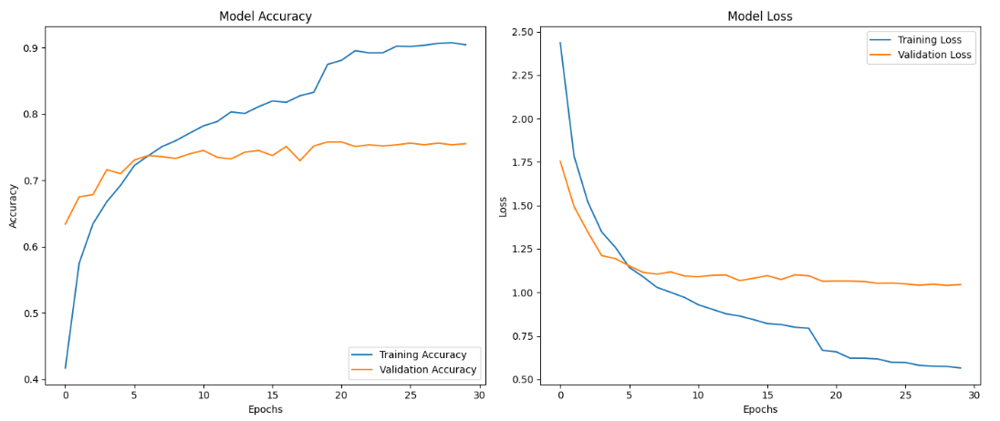

# Machine Learning
We developed a highly efficient food image classification model using custom convolutional neural networks (CNN) combined with transfer learning using VGG16. Utilizing the VGG16 architecture, a well-known and highly effective deep learning model, we significantly enhanced our model's performance. We trained this model with thousands of food images across 14 class labels, achieving an accuracy rate of over 80%. This ensures our application can reliably provide users with precise nutritional information based on their uploaded food images.




## Datasets
This is our [Dataset](https://drive.google.com/drive/folders/1gVJCdNCKionhBdR5HBitFLLD7O0DSGHj?usp=sharing)
For the datasets, we search from various sources on Kaggle and merge them together. So that 14 labels are collected, which are:
1. Bakso
2. Burger
3. Caesar Salad
4. Cumi Goreng Tepung
5. Kerang Tiram
6. Nasi
7. Nasi goreng
8. Omelette
9. Sate Ayam
10. Sayap Ayam Goreng
11. Siomay
12. Spaghetti
13. Steak
14. Yoghurt

## Model
This is our [Model]([https://drive.google.com/drive/folders/1gVJCdNCKionhBdR5HBitFLLD7O0DSGHj?usp=sharing](https://drive.google.com/drive/folders/1mk_ummae3FHSwoSOdjGgohM9Jd1VmCQZ?usp=sharing))

```python
base_model = VGG16(weights='imagenet', include_top=False, input_shape=(224, 224, 3))
model = models.Sequential([
    base_model,
    layers.Flatten(),
    layers.Dense(512, activation='relu', kernel_regularizer=regularizers.l2(0.001)),
    layers.Dropout(0.6),
    layers.Dense(train_dataset.num_classes, activation='softmax')
])
```

The model architecture using transfer learning with a pre-trained VGG16 model as a feature extractor, combined with custom layers for classification. Below is a brief explanation for our Image Classification Model Architecture:

- Base Model: VGG16
    - Weights: Pre-trained on ImageNet.
    - Top Layers: Excluded.
    - Input Shape: (224, 224, 3), matching the input image dimensions.
    - Purpose: Acts as a powerful feature extractor, leveraging its learned convolutional filters.
      
- Custom Layers

    - Flatten Layer: Converts the 3D feature maps from the VGG16 model into a 1D feature vector.
    - Dense Layer:
          - Units: 512 neurons.
          - Activation: ReLU (Rectified Linear Unit).
          - Regularization: L2 regularization with a penalty factor of 0.001 to prevent overfitting.
    - Dropout Layer:
          - Rate: 0.6, dropping 60% of the units to further mitigate overfitting.
    - Output Dense Layer:
          - Units: Equal to the number of classes in the train_dataset.
          - Activation: Softmax, providing probabilities for each class.

## Training
The model is trained using the model.fit() method on the train_dataset for 30 epochs, with validation_generator providing the validation data. To enhance training efficiency and model performance, two key callbacks are employed: EarlyStopping and ReduceLROnPlateau.

```python
early_stopping = EarlyStopping(monitor='val_loss', patience=10, restore_best_weights=True)
reduce_lr = ReduceLROnPlateau(monitor='val_loss', factor=0.2, patience=5, min_lr=0.00001)

history = model.fit(
    train_dataset,
    epochs=30,
    validation_data=validation_generator,
    callbacks=[reduce_lr, early_stopping]
)
```

- Model Training
    - Method: model.fit()
    - Training Data: train_dataset
    - Epochs: 30
    - Validation Data: validation_generator
    - Callbacks: reduce_lr, early_stopping - Utilizes both callbacks for optimized training.

- Callbacks
    - EarlyStopping
        - Monitor: val_loss - Stops training when validation loss stops improving.
        - Patience: 10 epochs - Waits for 10 epochs before stopping if no improvement.
        - Restore Best Weights: Restores model weights from the epoch with the best validation loss.
    - ReduceLROnPlateau
        - Monitor: val_loss - Reduces learning rate when validation loss plateaus.
        - Factor: 0.2 - Reduces the learning rate by a factor of 0.2.
        - Patience: 5 epochs - Waits for 5 epochs before reducing learning rate.
        - Min LR: 0.00001 - Ensures the learning rate doesn't go below this threshold.

## ML API Documentation 
### URL
https://backend-ml-api-4-gsmsrhmyzq-et.a.run.app/
## Predict Image

#### URL
`/predict`

#### Method
POST


#### Parameters
- `photo` : file multipartbody


#### Request Body and Response JSON
##### Request Body 
-
  ```json
  {
    "photo": file(image/jpeg, image/png) 
  }

- Response 200 OK
  ```json
    {
    "confidenceScore": 85.97714900970459,
    "data": [
        {
            "calories": 76,
            "carbohydrate": 9.2,
            "fat": 2.5,
            "food_id": 64,
            "image_url": "https://storage.googleapis.com/caloriewise-bucket-c241-ps066/images/foods/64.jpg",
            "name": "Bakso",
            "proteins": 4.1
        }
    ],
    "error": false,
    "isAboveThreshold": true,
    "message": "Model is predicted successfully.",
    "status": 200
    }

