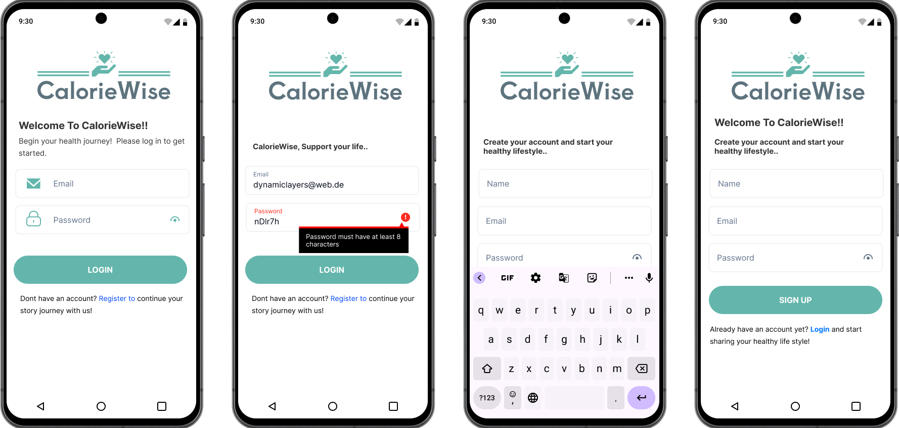
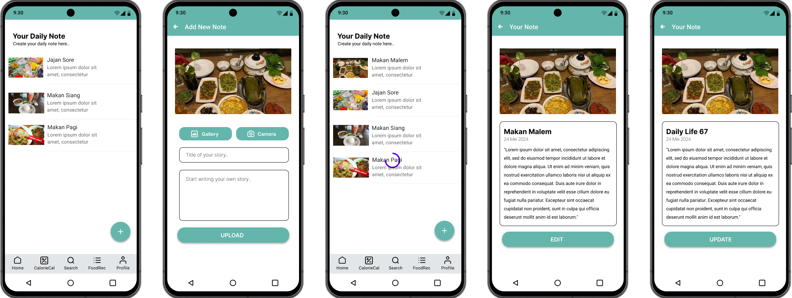
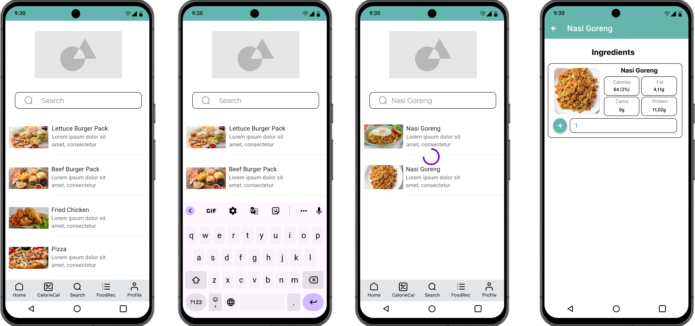
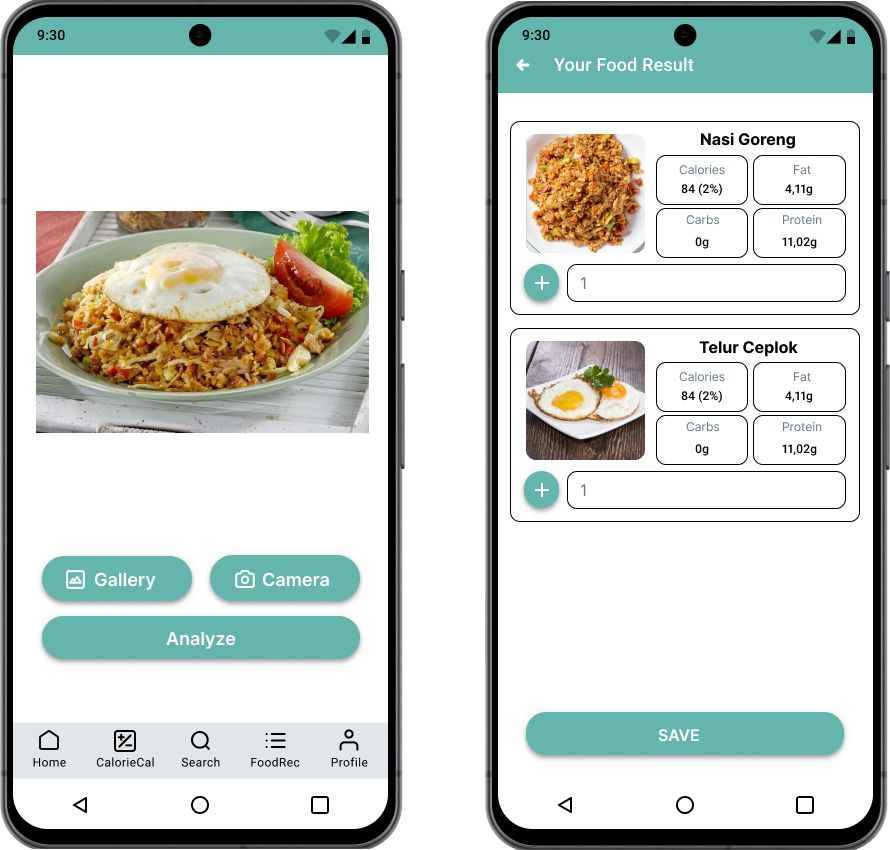
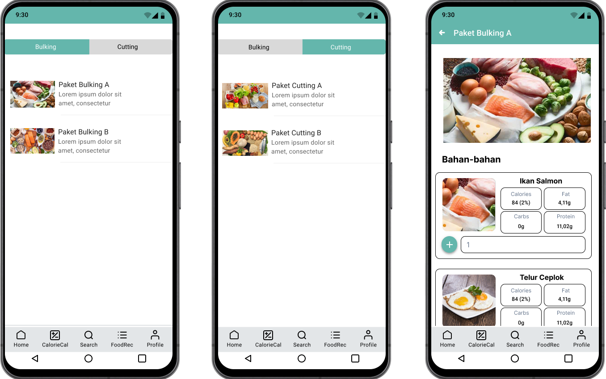
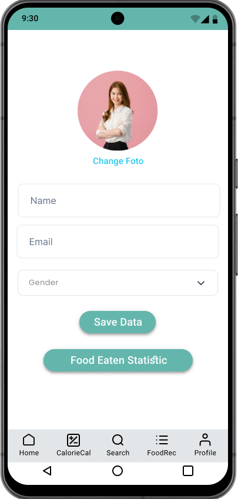
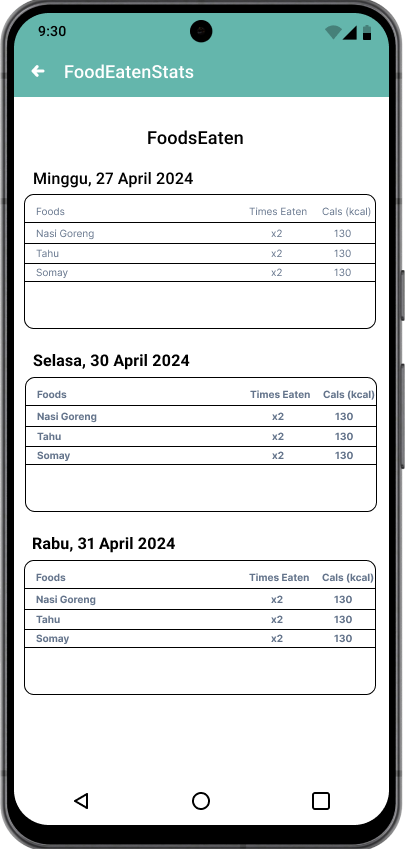

## Mobile Development

### Features

- Login and Register  

- Adding your daily note. On this feature, user can make a daily note on what they been eating. And the note will be featured in note page  

- Food Searching. finding food and ingredients simply by typing the name of the food, you can find out the nutritional content of the food, namely calories, protein, fat, carbohydrate.  

- Food Analyze. Pick image from camera, it will detect what is your food and the nutritions.  

- Food Recommendation, there are 2 options which is bulking for gain weight or cutting for lose weight  

- Profile Views. with this feature you can change your profile photo, your name, your email.  

- Food History. you can see the history of the nutritions of your meals by date  

### Tools
- Android Studio
- JRE (Java Runtime Environment) or JDK (Java Development Kit).
